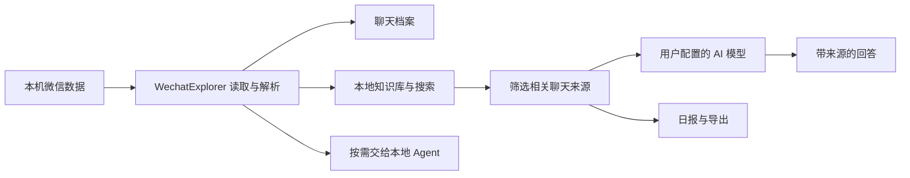

# WechatExplorer

<p align="center">
  
</p>

<h2 align="center">把微信聊过的事，找回来、问清楚、留下来</h2>

<p align="center">
  本地优先的微信聊天记录工作台：查看、搜索、提问、总结和导出<br />
  查看聊天 · 找回信息 · AI 问答 · 群聊日报 · 语音转写 · 导出 · 实时微信交互
</p>

<p align="center">
  
  
  
</p>

<p align="center">
  <a href="https://github.com/Wxw-Gu/WechatExplorer/releases"><b>下载 WechatExplorer</b></a>
  ·
  <a href="./docs/user-guide/getting-started.md"><b>第一次使用</b></a>
  ·
  <a href="./docs/README.md"><b>完整文档</b></a>
</p>

<p align="center">
  
</p>

## WechatExplorer 是什么

WechatExplorer 帮你在自己的电脑上读取和整理微信聊天记录。

你可以直接浏览聊天，也可以用自然语言提问：

> “上个月我们讨论过哪些发布问题？”
> “张三之前发过的项目地址在哪里？”
> “技术交流群今天有哪些结论和待办？”

它和普通聊天记录查看器最大的不同，是 AI 回答可以回到原始聊天核对。你可以看到回答参考了哪些内容、来自哪个会话和时间，再回到消息上下文确认它有没有理解错。

## 你可以用它做什么

### 查看和搜索自己的微信记录

- 浏览联系人、群聊、折叠群聊和公众号消息。
- 查看文本、图片、视频、语音、文件、链接、引用、小程序等内容。
- 搜索会话或当前聊天中的关键词。
- 从 AI 结果跳回对应聊天位置。

详细说明：[聊天档案与普通搜索](./docs/user-guide/chat-archive.md)

### 直接向微信历史提问

打开“问问微信”，选择搜索范围和时间，然后像提问一样描述你想找的内容。

WechatExplorer 会先在本机查找候选消息，再把整理后的少量来源交给你配置的 AI 模型生成回答。回答中的来源标记可以定位到对应聊天证据；“查看检索详情”还会展示本次查找经历了哪些阶段。

<p align="center">
  
</p>

详细说明：[使用 AI 查找聊天信息](./docs/user-guide/ai-search.md)

### 让重要信息以后更容易找到

“问问微信”里的“本地知识库”会为当前微信账号建立一份留在本机的可检索资料。它把聊天文本、附件信息和已有语音转写整理起来，让跨会话、跨时间查找更稳定。

- 用户主动点击后才会建立。
- 支持同步最新记录。
- 显示已索引消息、知识片段和磁盘占用。
- 可以从设置中清理，清理不会删除微信原始数据库。

详细说明：[本地知识库](./docs/user-guide/knowledge.md)

### 检查 AI 回答依据

AI 给出答案后，你可以继续确认：

- 它参考了哪几条聊天内容；
- 来源属于哪个人、会话和时间；
- 回答中的来源编号对应哪条原始消息；
- 本次搜索经过了哪些步骤、用了多长时间；
- 当前结果是否只覆盖了部分聊天或遗漏了未转写语音。

想进一步了解来源标记和查找过程，阅读[如何核对 AI 的回答来源](./docs/concepts/answer-sources.md)。

### 生成群聊日报

选择群聊和时间范围后，可以让 AI 把聊天整理成热点、重要消息、资源、问答、待办、未解决事项、活跃统计和图片精选，并导出 HTML 与 PNG 长图。

<p align="center">
  
</p>

详细说明：[生成群聊日报](./docs/user-guide/report.md)

### 转写微信语音

WechatExplorer 提供本地离线语音识别：

- 在聊天气泡中转写单条语音；
- 按联系人或群聊批量转写；
- 转写结果可以参与本地知识库检索和 HTML 导出；
- 本地转写本身不需要把语音文件发送给在线 AI；如果你随后用转写结果进行 AI 问答或日报，文字会按对应功能的规则处理。

详细说明：[语音转文字](./docs/user-guide/voice.md)

### 导出长期可用的聊天档案

支持 HTML、CSV、JSON 和 Markdown。HTML 可携带媒体、头像和可选语音转写，也可以压缩为 ZIP；再次使用同名档案导出时可以增量合并新消息。

详细说明：[导出聊天](./docs/user-guide/export.md)

### 如果你要让 Agent 读取微信数据

WechatExplorer 提供 Local HTTP API 和 Reader Skill。安装后，Codex、Claude Code、OpenClaw 等 Agent 可以在你的电脑上按需查询聊天：

> “总结今天技术交流群讨论了什么。”
> “过去一周有没有人提到某个项目？”

它提供的是随应用安装的 Reader Skill 和本机 Local HTTP API。连接后，Agent 可以按需查找联系人、群聊和聊天记录，再帮你做总结。安装和完整技术说明请看[Agent 接入概览](./docs/agent/overview.md)与[Local HTTP API](./docs/agent/api.md)。

### 连接微信机器人，让 AI 参与实时微信工作

除了读取过去的聊天，你还可以在应用里的“Agent”页面（页面标题为“Agent Hub”）扫码连接一个微信机器人账号。机器人收到你发来的文字后，会在本机调用 WechatExplorer 已连接的聊天数据，并把结果回复给发消息的人。

目前已经支持的实时任务包括：

- 查看最近会话；
- 查询你和某位联系人的近期聊天；
- 用已配置的 AI 总结你和某位联系人近 7 天的聊天；
- 生成今天、昨天或近 7 天的群聊总结图片；
- 总结指定群成员在群里的近期发言；
- 对不需要读取聊天的普通文字请求给出简短 AI 回复。

例如，你可以直接给机器人发“最近 5 个会话”，或“生成产品交流群今天的群聊总结图片”。需要读取历史数据时，WechatExplorer 必须已经连接微信数据库；需要总结或自然语言理解时，还要在“设置 → AI 模型”中配置可用的 AI 服务。

这条路径和上面的 Reader Skill / Local HTTP API 不同：Reader Skill/API 是外部 Agent 主动查询历史微信数据；Agent Hub 则是微信机器人收到实时消息后处理并回复。当前实时入口主要处理文字消息，不应把它理解成支持任意媒体理解、群发、定时任务或通用自主操作的机器人。

详细步骤和能力边界见[Agent Hub：从微信里向本机助手提问](./docs/agent/agent-hub.md)。

## 它如何工作



- 微信数据库读取、聊天解析、知识库索引和离线语音识别在本机完成。
- 普通浏览、普通搜索和导出不要求配置 AI 服务。
- 你主动使用并确认“问问微信”、群聊日报或图片理解时，完成任务所需的内容可能发送到你选择的模型服务。
- “问问微信”会先在本机缩小范围，不会默认把整个微信数据库作为一次模型请求发送。
完整边界见：[数据、隐私与安全](./docs/user-guide/privacy.md)

## 快速开始

1. 从 [GitHub Releases](https://github.com/Wxw-Gu/WechatExplorer/releases) 下载安装包。
2. 启动 WechatExplorer，按照“第一次使用”页面选择微信数据目录。
3. 第一次使用请先点击“开始连接”，按页面提示准备连接组件并获取数据库密钥；只有已经有密钥的高级用户才需要“手动连接”。
4. 连接成功后打开“档案”，确认联系人和聊天消息已经出现。
5. 需要 AI 时，在“设置 → AI 模型”添加并测试 AI 服务。
6. 打开“问问微信”，按需要建立本地知识库；如果正在同步，等待状态变为“已同步”后再开始第一个问题。

当前代码面向微信 4.x 数据结构。Windows 发布构建为 x64；macOS 发布构建提供 Intel 和 Apple Silicon 版本。macOS 首次连接可能需要按页面提示完成系统授权；如果页面提示处理 SIP，请先阅读对应说明。具体步骤和限制见[第一次使用](./docs/user-guide/getting-started.md)。

完整步骤：[第一次使用 WechatExplorer](./docs/user-guide/getting-started.md)

## 配置 AI

需要 AI 问答、群聊日报或图片理解时，在“设置 → AI 模型”添加并测试一个服务。应用支持云端服务、Ollama 等本地服务和自定义接口；具体服务商的配置、计费和数据规则由服务商决定。

使用本地服务可以减少数据离开电脑的路径，但本地服务的日志和配置仍由你自己负责。

开发者和 Agent 用户可以从[Agent 接入概览](./docs/agent/overview.md)开始，再按需要查看[Local HTTP API](./docs/agent/api.md)与[API 安全](./docs/agent/api-security.md)。

## 文档

- [文档首页](./docs/README.md)
- [第一次使用](./docs/user-guide/getting-started.md)
- [聊天档案与搜索](./docs/user-guide/chat-archive.md)
- [AI 查找聊天信息](./docs/user-guide/ai-search.md)
- [本地知识库](./docs/user-guide/knowledge.md)
- [群聊日报](./docs/user-guide/report.md)
- [语音转文字](./docs/user-guide/voice.md)
- [导出聊天](./docs/user-guide/export.md)
- [数据、隐私与安全](./docs/user-guide/privacy.md)
- [Agent 接入](./docs/agent/overview.md)
- [微信机器人与 Agent Hub](./docs/agent/agent-hub.md)
- [Local HTTP API](./docs/agent/api.md)
- [开发与测试](./docs/development/overview.md)

## 本地开发

需要 Node.js、pnpm 7+、对应平台的 Electron/native 构建环境，以及 Go（用于微信连接器）。

```bash
pnpm install
pnpm dev
```

常用检查：

```bash
pnpm typecheck
pnpm test:unit
pnpm test:component
pnpm test:integration
pnpm test:e2e:build
```

完整说明：[开发、测试与构建](./docs/development/overview.md)

## 支持与反馈

遇到问题时，先查看[常见问题与排查](./docs/user-guide/troubleshooting.md)。提交 Issue 时请提供操作系统、微信版本、WechatExplorer 版本、复现步骤和已遮挡敏感信息的截图。

请仅处理你有权访问的数据，并遵守适用的法律法规、组织政策和微信使用规则。数据库读取、解密、自动化和机器人能力都可能受平台版本与账号环境影响。

## 许可说明

仓库中的第三方组件、模型和连接器遵循各自的许可证。当前仓库根目录未提供独立的项目 `LICENSE` 文件；贡献、复制或再分发前，请先向维护者确认 WechatExplorer 本身的许可范围。
