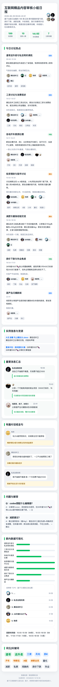
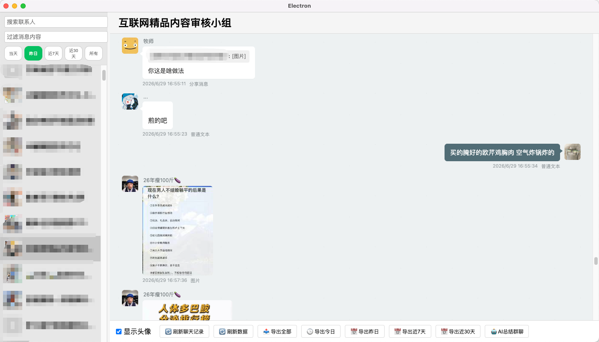

# WechatExplorer

MAC系统 获取微信聊天记录 AI一键生成群聊总结
是一个基于 Electron + React + TypeScript 开发的微信聊天记录查看与分析工具。它支持查看解密后的微信数据库内容，提供聊天记录搜索、导出以及 AI 智能总结功能。

## 项目说明

本项目的目标，是在自己的电脑上实现“本地查看微信聊天记录 + 一键生成群聊总结”的实用能力。

在微信 4.0 数据库解析、解密思路上，项目参考了 [WeFlow](https://github.com/hicccc77/WeFlow) 等开源项目的实现方式；此项目围绕我自己的使用场景做的定制化工具，重点放在本地聊天记录查看、群聊总结和个人工作流集成上。

## ✨ 功能特性

- **聊天记录查看**: 浏览微信好友和群聊的聊天记录，支持头像显示。
- **全局搜索**: 快速搜索聊天内容。
- **AI 智能总结**: 支持多模型服务配置（DeepSeek/GPT-4o/Claude/Moonshot），一键总结群聊精华内容，生成话题报告。
- **群聊日报生成**: 支持围绕群聊内容生成日报，通常会覆盖以下模块中的部分或全部内容：
  - **今日讨论热点**: 梳理群内主要话题，支持热度标签。
  - **实用信息与资源**: 提取分享的链接、资源等信息。
  - **重要消息汇总**: 标记并展示重要消息，带发送者头像。
  - **有趣对话或金句**: 收录群内的精彩对话。
  - **问题与解答**: 整理群内的问答内容。
  - **群内数据可视化**: 消息热度条形图、话唠榜 TOP5、活跃时间线。
  - **词云/关键词**: 可视化展示群聊关键词。
- **图片生成**: 将 AI 总结的内容生成精美图片，方便分享。
- **数据导出**: 支持导出聊天记录为 CSV 文件（今日、昨日、近7天或全部）。
- **安全隐私**: 所有数据仅在本地处理，AI 功能需自行配置 API Key。

## 📸 预览

### 群聊总结长图



### 软件主页面



## [点击这里下载](https://github.com/Wxw-Gu/WechatExplorer/releases)

## 📦 安装说明

1. 下载下方的 `xxx.dmg` 文件。
2. 打开 DMG 并将应用拖动到 **Applications** (应用程序) 文件夹。
3. 如果遇到“无法打开，因为开发者无法验证”的提示，请前往：
   `系统设置 -> 隐私与安全性 -> 仍要打开`。

## 🚀 快速开始

### 使用前置要求

- **微信版本**:
  - 微信 4.0+: 已支持部分能力，仍在持续迭代与兼容性验证中；如需更成熟的完整方案，推荐使用 [WeFlow](https://github.com/hicccc77/WeFlow) [Chatlog](https://github.com/sjzar/chatlog)
- 如无法获取本地数据库密码，则无法使用当前项目
- Node.js (推荐 v16+)
- pnpm@7
- 解密后的微信数据库文件 (`.db`) 和对应的密钥
- AI API Key（支持 OpenAI 兼容 API，可选 DeepSeek/GPT/Claude/Moonshot 等）

### 环境变量配置 (.env)

可选配置项，可在 `.env` 文件中设置：

| 变量名                  | 说明                        | 示例                        |
| ----------------------- | --------------------------- | --------------------------- |
| `VITE_DB_KEY`           | 微信数据库密钥 (32字节hex)  | `YOUR_DB_KEY_HERE`          |
| `VITE_IMAGE_XOR_KEY`    | 图片解密 XOR 密钥 (hex格式) | `0x40`                      |
| `VITE_IMAGE_AES_KEY`    | 图片解密 AES 密钥 (16字符)  | `YOUR_AES_KEY_HERE`         |
| `VITE_DEEPSEEK_API_KEY` | DeepSeek API Key            | `sk-xxx`                    |
| `VITE_AI_BASE_URL`      | AI API 地址                 | `https://api.deepseek.com`  |
| `VITE_AI_MODEL`         | AI 模型                     | `deepseek-chat`             |
| `VITE_FILTER_MSG_TYPES` | 过滤的消息类型              | `分享消息,图片,表情包,视频` |

#### 图片解密密钥说明

微信 4.0+ 的图片以 `.dat` 文件存储，需要密钥解密：

- **XOR Key**: 单字节 hex 值（如 `0x40`），用于简单的字节异或解密
- **AES Key**: 16字符字符串，用于 AES-128-ECB 解密

这两个密钥可以通过以下方式获取：

1. 从 WeFlow/Chatlog 设置中导出
2. 使用内存扫描工具从微信进程中自动提取（待实现）

## 🤖 AI 集成（本地 HTTP API）

WechatExplorer 内置了一个本地 HTTP API 服务，默认监听 `127.0.0.1:6131`（纯本地，无鉴权），让你能够从 **Claude Desktop / Claude Code / Codex / curl / 任何脚本** 读取已经解锁的微信聊天记录。

### 启用本地 API

API 服务在 WechatExplorer 启动时自动启用，**不需要任何配置**。只需要：
1. 安装并启动 WechatExplorer
2. 完成首次密钥配置（主窗口第一步），解锁 WCDB 数据库
3. API 即在 `http://127.0.0.1:6131` 可用

### 7×24 提供 API（菜单栏常驻模式）

默认情况下，关闭主窗口时 macOS 会让 app 继续运行，但 Windows / Linux 会退出。如果希望主窗口关闭后 API 服务仍可用，启用菜单栏模式：

```bash
# 任选一种方式
WXE_TRAY=1 open /Applications/WechatExplorer.app
/Applications/WechatExplorer.app/Contents/MacOS/WechatExplorer --tray
```

启用后：
- macOS dock 图标自动隐藏
- 菜单栏出现 WechatExplorer 图标（可点击重新打开主窗口、查看 API 状态）
- 主窗口关闭后 API 服务继续运行

### API 端点一览

| 端点 | 说明 |
|------|------|
| `GET /api/v1/health` | 健康检查 |
| `GET /api/v1/current_time` | 获取当前本地时间（用于"今天/昨天"换算） |
| `GET /api/v1/contact?filter=xxx` | 联系人 / 群聊列表 |
| `GET /api/v1/chatroom?keyword=xxx` | 搜索群聊 |
| `GET /api/v1/chatlog?talker=xxx&time=2026-07-03` | 聊天记录 |
| `GET /api/v1/group_snapshot?md5=xxx` | 群成员快照 |
| `GET /api/v1/resolve?q=群昵称` | 把昵称/wxid/md5 解析成 md5 |

详细参数、返回结构、时间格式见 [`docs/skill/wechatexplorer-reader/SKILL.md`](./docs/skill/wechatexplorer-reader/SKILL.md)。

### 让 Claude 自动总结你的群聊

复制 [`docs/skill/wechatexplorer-reader/SKILL.md`](./docs/skill/wechatexplorer-reader/SKILL.md) 到 `~/.claude/skills/`，然后在 Claude Desktop 里说：

> "今天 技术交流群 聊了啥？"

Claude 会自动：
1. 调 `current_time` 拿到今天日期
2. 调 `chatroom` 找到目标群
3. 调 `chatlog` 拿 JSON 聊天记录
4. 自己用 LLM 生成总结报告

### curl 示例

```bash
# 健康检查
curl http://127.0.0.1:6131/api/v1/health

# 今天 摸鱼交流群 的聊天记录
curl -G "http://127.0.0.1:6131/api/v1/chatlog" \
  --data-urlencode "talker=摸鱼交流群" \
  --data-urlencode "time=$(date +%Y-%m-%d)"

# 把群昵称解析成 md5
curl -G "http://127.0.0.1:6131/api/v1/resolve" \
  --data-urlencode "q=摸鱼交流群"
```

## ⚠️ 免责声明

本项目仅供学习和研究使用。请勿用于非法用途。开发者不对使用本项目造成的任何后果负责。请遵守相关法律法规和微信使用协议。

## 🔗 参考

- [WechatMessageExplorer](https://github.com/svcvit/WechatMessageExplorer)
- [WeFlow](https://github.com/hicccc77/WeFlow)
- [chatlog](https://github.com/sjzar/chatlog)
