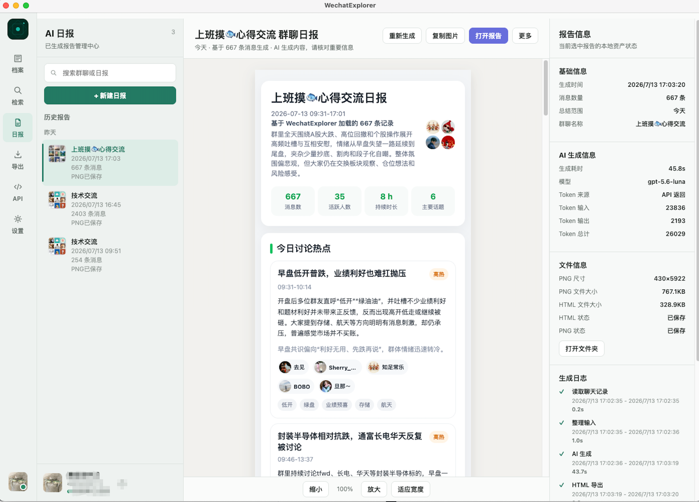
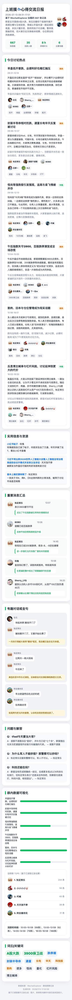
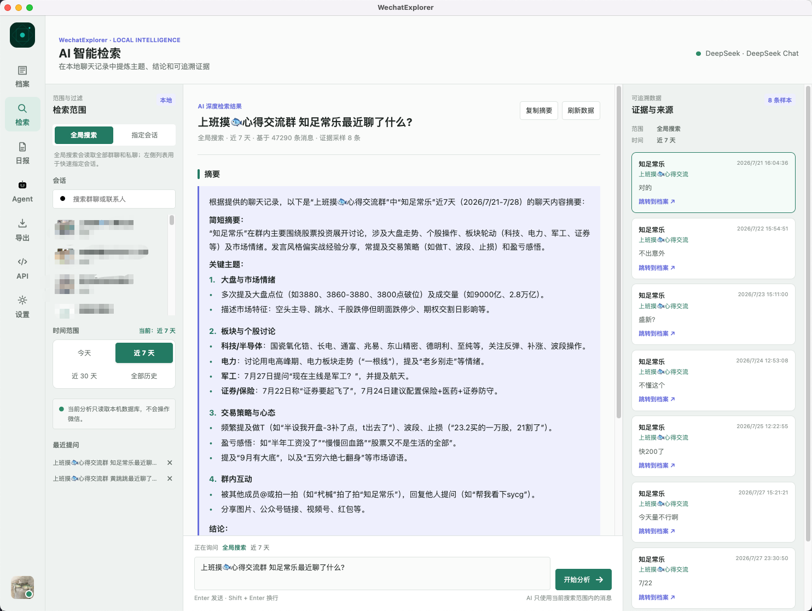
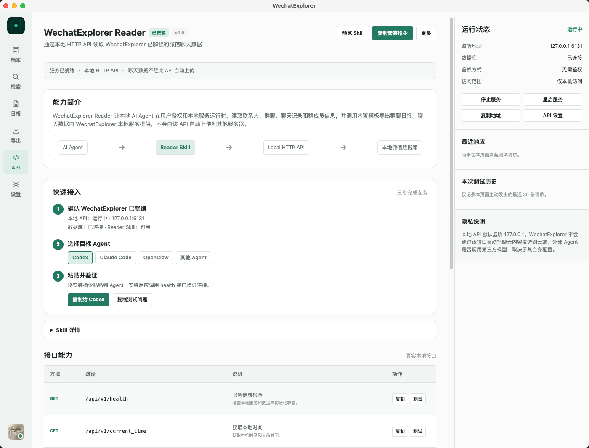
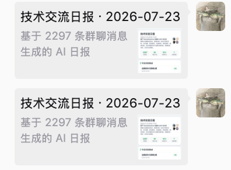
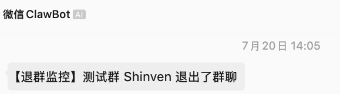

# WechatExplorer

<p align="center">
  
</p>

<h2 align="center">让 AI 读懂你的微信</h2>

<p align="center">
  本地优先的 AI 微信助手<br />
  聊天记录查看 · AI 问问微信 · 群聊日报 · Agent · 本地 API
</p>

<p align="center">
  
  
  
</p>

<p align="center">
  <a href="https://github.com/Wxw-Gu/WechatExplorer/releases"><b>📦 下载最新版</b></a>
  ·
  <a href="./docs/user-guide/getting-started.md"><b>🚀 第一次使用</b></a>
  ·
  <a href="./docs/user-guide/getting-started.md#遇到问题"><b>📖 使用说明</b></a>
</p>

> ⭐ 如果这个项目帮助到了你，欢迎点一个 Star，支持项目持续更新。

<p align="center">
  
</p>

> 像问 ChatGPT 一样，直接询问你的微信聊天记录。

WechatExplorer 是一个基于 Electron + React + TypeScript 开发的本地优先 AI 微信助手。它不只是查看聊天记录，而是把聊天内容变成可以搜索、总结、分析和交给 Agent 使用的信息。

**支持：**

微信聊天记录查看、AI 微信助手、AI 群聊日报、MCP、Agent、本地 API

## ✨ 为什么选择 WechatExplorer？

- ✅ **像 ChatGPT 一样搜索整个微信**：用自然语言提问，快速找到聊天上下文。
- ✅ **AI 自动生成群聊日报**：自动整理热点、资源、问答和待跟进事项。
- ✅ **Agent 可直接读取微信聊天**：支持 Codex、Claude Code、MCP 等 AI 工作流。
- ✅ **本地数据库优先**：聊天数据默认保存在本机，不会自动上传。
- ✅ **支持微信 3.x / 4.x**：不同微信版本提供对应版本支持。
- ✅ **多格式导出**：支持 HTML、Markdown、CSV 和 JSON。

## 🚀 第一次使用

软件已经内置完整的新手引导，通常按下面三步即可开始：

```text
下载软件
   ↓
连接微信
   ↓
开始问你的微信
```

首次启动会自动进入「第一次使用」页面。连接成功后，软件会显示「开始探索你的微信」；进入主界面后，还可以随时点击左下角「新手引导」重新查看。

## 📸 功能预览

### AI 群聊日报

<details>
  <summary>点击查看完整日报模板</summary>
  <br />
  
</details>

### AI 问问微信



### 本地 API 与 Agent



## 🎯 它能帮你做什么

### 🤖 AI 问问微信

直接向自己的微信提问：

> “去年我和老板聊过哪些关于涨薪的事情？”
>
> “技术群这周讨论了哪些问题？”
>
> “帮我找到张三发过的项目地址。”

### 📰 AI 群聊日报

选择一个群聊和时间范围，自动生成：

- ✅ 今日热点
- ✅ 一句话总结
- ✅ 资源汇总
- ✅ 问答整理
- ✅ 活跃榜
- ✅ 词云与关键词

<details>
  <summary>展开查看日报的完整模块</summary>

- **今日讨论热点**：梳理群内主要话题，支持热度标签。
- **一句话速览**：首屏突出今日核心结论与待跟进事项。
- **实用信息与资源**：提取分享的链接、资源等信息。
- **重要消息汇总**：标记并展示重要消息，带发送者头像。
- **有趣对话或金句**：收录群内的精彩对话。
- **问题与解答**：整理群内的问答内容。
- **尚未解决 / 今日剧情线**：适合工作群和项目群的回顾与跟进。
- **今日群相册 / 语音时长榜 / 临时群友称号**：让图片、语音和氛围型内容也能参与日报。
- **群内数据可视化**：消息热度条形图、话唠榜 TOP5、活跃时间线。
- **词云 / 关键词**：可视化展示群聊关键词。
</details>

支持导出 HTML 与 PNG，也支持图片理解和图片生成。

### 📂 查看聊天

浏览微信好友和群聊的聊天记录，支持查看：

- 文本
- 图片
- 视频
- 语音
- 文件

同时支持头像显示、全局搜索、指定会话搜索、消息防撤回和上下文定位。

### 📤 导出聊天

支持按会话和时间范围导出聊天记录为 HTML、CSV、JSON 或 Markdown，并可以打开文件所在文件夹。

### 🤖 Agent

通过本地 HTTP API 和内置 Reader Skill，让 Codex、Claude Code 等 Agent 在本机服务运行并获得授权后读取、总结聊天数据。

## 🚀 规划与未来（Roadmap）

WechatExplorer 仍在持续演进，未来会围绕 **AI 大模型 + 微信 + Agent** 持续完善能力。

下面是正在设计或计划中的部分功能（不代表发布时间）。

<details>
  <summary>点击展开未来规划</summary>

### 🚧 人物镜像（Persona）

根据长期聊天记录生成每个人的沟通画像：

- 兴趣标签
- 常聊话题
- 表达风格
- 个性化沟通参考

### 🚧 AI 长期记忆

让 AI 持续理解你的聊天历史，在不同时间跨度内建立上下文，支持长期事项追踪和连续对话。

### 🚧 微信卡片分享

将 AI 日报生成可点击的微信卡片消息，而不仅仅是图片，方便在群聊中传播与查看。

<p align="center">
  
</p>

### 🚧 退群自动监控

自动记录群聊成员变动：

- 谁加入群聊
- 谁退出群聊
- 变动发生的时间
- 群成员变动记录

<p align="center">
  
</p>

### 💡 更多 AI 能力

包括会议纪要、聊天知识库、长期事项追踪、个人成长分析等更多探索。

WechatExplorer 希望不仅仅是一个聊天记录查看工具，更希望成为一个能够理解、整理和协助管理微信信息的 AI 工作平台。

如果你有好的想法，欢迎提交 Issue 或 Pull Request，一起把它做得更好。

</details>

## ⚙️ 快速开始

### 下载并安装

从 [GitHub Releases](https://github.com/Wxw-Gu/WechatExplorer/releases) 下载对应系统的安装包：

- Windows：下载 `-setup.exe` 并按安装向导完成安装。
- macOS：下载 `.dmg`，将 WechatExplorer 拖入“应用程序”。首次打开若被系统拦截，请在“系统设置 → 隐私与安全性”中允许打开。

### 连接微信

按照软件内置的「第一次使用」引导完成连接：

1. 确认微信数据目录。
2. 让微信停在登录页面。
3. 点击“开始获取”，按提示完成连接。

Windows 已完整支持，不需要关闭 SIP。macOS 首次自动获取数据库密钥前，需要关闭 SIP 并完成系统授权。

### 配置 AI

进入「设置 → AI 模型」，添加模型服务商并填写 API Key，保存并测试成功后即可使用「问问微信」和「日报」。支持：

- OpenAI
- DeepSeek
- Claude
- Moonshot
- OpenAI 兼容接口

### 下一步

| 你想做什么        | 从哪里开始                                                       |
| ----------------- | ---------------------------------------------------------------- |
| 重新查看连接步骤  | 点击左下角「新手引导」                                           |
| 直接向微信提问    | 打开「问问微信」                                                 |
| 生成群聊日报      | 打开「日报」                                                     |
| 浏览聊天记录      | 打开「档案」                                                     |
| 导出聊天记录      | 打开「导出」                                                     |
| 让 Agent 读取微信 | [Reader Skill 文档](./docs/skill/wechatexplorer-reader/SKILL.md) |

## 🖥️ 支持平台与微信版本

- **Windows**：已完整支持 Windows x64，不需要关闭 SIP。
- **macOS**：支持 Intel 和 Apple Silicon；首次自动获取数据库密钥前，需要关闭 SIP 并完成系统授权。
- **微信 3.0**：请使用 [v1.1.0 版本](https://github.com/Wxw-Gu/WechatExplorer/releases/tag/v1.1.0)。
- **微信 4.0**：使用当前 Releases 中的最新版。

不同微信版本、账号和数据目录可能存在差异，遇到连接问题时请优先参考 [使用说明](./docs/user-guide/getting-started.md)。

## 🔒 隐私与权限

- WechatExplorer 只读取你有权访问的本机微信数据。
- 不使用 AI 时，应用不会因为读取聊天记录而自动上传聊天内容。
- 使用 AI 问问微信、日报或图片理解时，相关内容会发送到你配置的模型服务。
- 本地 API 默认监听 `127.0.0.1`，无鉴权；请按可信网络范围配置。
- 消息防撤回、图片解密和数据库密钥等能力都应只用于你有权访问的数据。

## 🔌 高级能力：本地 HTTP API 与 Agent

<details>
  <summary>展开本地 HTTP API、Reader Skill 和 Agent 说明</summary>

WechatExplorer 内置一个本地 HTTP API 服务，默认监听 `127.0.0.1:6131`，纯本地、无鉴权。完成数据库连接后，API 会自动启用。

### 启用本地 API

1. 安装并启动 WechatExplorer。
2. 完成首次密钥配置，解锁 WCDB 数据库。
3. 在 `http://127.0.0.1:6131` 使用本地 API。

### 7×24 提供 API（菜单栏常驻模式）

默认情况下，关闭主窗口时 macOS 会让 app 继续运行，但 Windows / Linux 会退出。如果希望主窗口关闭后 API 服务仍可用，可以启用菜单栏模式：

```bash
WXE_TRAY=1 open /Applications/WechatExplorer.app
/Applications/WechatExplorer.app/Contents/MacOS/WechatExplorer --tray
```

启用后：

- macOS Dock 图标自动隐藏。
- 菜单栏出现 WechatExplorer 图标，可重新打开主窗口、查看 API 状态。
- 主窗口关闭后 API 服务继续运行。

### API 端点一览

| 端点                                             | 说明                                    |
| ------------------------------------------------ | --------------------------------------- |
| `GET /api/v1/health`                             | 健康检查                                |
| `GET /api/v1/current_time`                       | 获取当前本地时间，用于“今天 / 昨天”换算 |
| `GET /api/v1/contact?filter=xxx`                 | 联系人 / 群聊列表                       |
| `GET /api/v1/chatroom?keyword=xxx`               | 搜索群聊                                |
| `GET /api/v1/chatlog?talker=xxx&time=2026-07-03` | 聊天记录                                |
| `GET /api/v1/group_snapshot?md5=xxx`             | 群成员快照                              |
| `GET /api/v1/resolve?q=群昵称`                   | 把昵称、wxid 或 md5 解析成 md5          |

详细参数、返回结构和时间格式见 [Reader Skill 文档](./docs/skill/wechatexplorer-reader/SKILL.md)。

### 安装 Reader Skill，让 Agent 读取和总结群聊

WechatExplorer 已内置 Reader Skill，无需手动复制仓库中的 `SKILL.md`：

1. 启动 WechatExplorer，并确认数据库已连接、本地 API 已运行。
2. 打开应用内的「API」页面。
3. 在“快速接入”中选择 Codex 或 Claude Code。
4. 点击复制安装指令，将指令粘贴给对应 Agent 执行。
5. 安装完成后，可以直接向 Agent 提问：

> “今天技术交流群聊了什么？”

Reader Skill 会自动获取本机时间、定位目标群聊、读取所需聊天记录，并结合上下文生成总结。

### curl 调试示例（可选）

不使用 Agent 时，也可以通过 `curl` 直接调试本地 HTTP API：

```bash
# 健康检查
curl http://127.0.0.1:6131/api/v1/health

# 今天“摸鱼交流群”的聊天记录
curl -G "http://127.0.0.1:6131/api/v1/chatlog" \
  --data-urlencode "talker=摸鱼交流群" \
  --data-urlencode "time=$(date +%Y-%m-%d)"

# 把群昵称解析成 md5
curl -G "http://127.0.0.1:6131/api/v1/resolve" \
  --data-urlencode "q=摸鱼交流群"
```

</details>

## 🛠️ 开发配置（可选）

<details>
  <summary>展开开发配置、环境变量和构建命令</summary>

本地开发需要 Node.js（建议当前 LTS）和 pnpm 7+：

```bash
pnpm install
pnpm dev
```

本地开发时运行 `pnpm dev` 会在 `.env` 不存在时自动从 `.env.example` 复制一份。成品用户不需要配置 `.env`，也可以直接在软件“设置”里填写 AI 和图片解密配置。

### 环境变量

| 变量名                  | 说明                          | 示例                        |
| ----------------------- | ----------------------------- | --------------------------- |
| `VITE_DB_KEY`           | 微信数据库密钥（32 字节 hex） | `YOUR_DB_KEY_HERE`          |
| `VITE_IMAGE_XOR_KEY`    | 图片解密 XOR 密钥（hex 格式） | `0x40`                      |
| `VITE_IMAGE_AES_KEY`    | 图片解密 AES 密钥（16 字符）  | `YOUR_AES_KEY_HERE`         |
| `VITE_DEEPSEEK_API_KEY` | DeepSeek API Key              | `sk-xxx`                    |
| `VITE_AI_BASE_URL`      | AI API 地址                   | `https://api.deepseek.com`  |
| `VITE_AI_MODEL`         | AI 模型                       | `deepseek-chat`             |
| `VITE_FILTER_MSG_TYPES` | 过滤的消息类型                | `分享消息,图片,表情包,视频` |

常用命令：

```bash
pnpm typecheck       # 类型检查
pnpm lint            # ESLint 检查
pnpm build           # 构建
pnpm build:win       # 构建 Windows x64 安装包
```

</details>

## ❓ FAQ

<details>
  <summary>展开常见问题</summary>

### 我已经连接成功，怎么重新查看教程？

点击左下角「新手引导」。首次连接流程、AI 配置入口、群聊日报、问问微信和完整教程都会再次展示。

### 微信 3.0 应该下载哪个版本？

请使用 [v1.1.0 版本](https://github.com/Wxw-Gu/WechatExplorer/releases/tag/v1.1.0)。微信 4.0 用户使用当前 Releases 中的最新版。

### AI 问问微信或群聊日报不可用怎么办？

进入「设置 → AI 模型」，添加模型服务商并填写 API Key，确认 Base URL 和模型名称正确，然后保存并测试连接。

### 连接失败怎么办？

请先查看 [使用说明](./docs/user-guide/getting-started.md) 的“遇到问题”部分，重点确认微信数据目录、微信登录状态、微信版本和 macOS SIP 设置。

</details>

## ⚠️ 免责声明

本项目仅供学习和研究使用。请勿用于非法用途。开发者不对使用本项目造成的任何后果负责。请遵守相关法律法规和微信使用协议，并仅处理你有权访问的数据。

## ⭐ Star History

<a href="https://www.star-history.com/?repos=Wxw-Gu%2FWechatExplorer&type=date&legend=top-left">
  <picture>
    <source media="(prefers-color-scheme: dark)" srcset="https://api.star-history.com/chart?repos=Wxw-Gu/WechatExplorer&type=date&theme=dark&legend=top-left&sealed_token=cSQi7zyyCJXEyry3kvUhQJUB3RY8PjpgsI4KKZMH7m06AzRJU0EtAtKHcHtmhhgWoOU5lOjCBh-mZGzX4j50AaKL2krLbHLA7Ip7P1MWWolL9_TPXin1kg" />
    <source media="(prefers-color-scheme: light)" srcset="https://api.star-history.com/chart?repos=Wxw-Gu/WechatExplorer&type=date&legend=top-left&sealed_token=cSQi7zyyCJXEyry3kvUhQJUB3RY8PjpgsI4KKZMH7m06AzRJU0EtAtKHcHtmhhgWoOU5lOjCBh-mZGzX4j50AaKL2krLbHLA7Ip7P1MWWolL9_TPXin1kg" />
    
  </picture>
</a>

## 致谢

<details>
  <summary>展开致谢与参考项目</summary>

WechatExplorer 在开发过程中参考了多个优秀的开源项目，感谢这些项目作者的工作与分享。

特别感谢：

- **[WechatMessageExplorer](https://github.com/svcvit/WechatMessageExplorer)**
  - 提供了微信数据库解析相关思路。
- **[WeFlow](https://github.com/hicccc77/WeFlow)**
  - 参考了数据库密钥获取、图片解密等实现思路。
- **[chatlog](https://github.com/sjzar/chatlog)**
  - 提供了聊天记录导出与数据处理方面的参考。

在此基础上，WechatExplorer 进行了重新设计与实现，包括：

- AI 问问微信
- AI 群聊日报
- 本地 HTTP API
- Reader Skill
- Agent Hub
- 新手引导
- Electron + React 全新界面
- 本地优先 AI 工作流

感谢所有开源作者。

</details>

## 💬 交流与反馈

请先完成 [第一次使用与问题排查](./docs/user-guide/getting-started.md)，再查看问题排查和 FAQ。只有自助排查仍无法解决时，再扫码进入交流群。

<p align="center">
  
</p>
