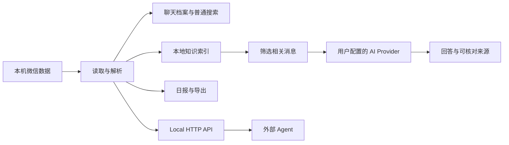

# WechatExplorer 如何把聊天变成可用的信息

你可以把一次任务想成下面这条路径：

## 哪些步骤在本机

- 微信数据库读取与解析；
- 聊天档案浏览和普通搜索；
- Knowledge 索引与增量同步；
- 离线语音转写；
- 报告、导出文件和本地历史记录。

## 哪些步骤可能调用外部服务

当你主动使用 AI Search、群聊日报或图片理解时，应用会把完成任务所需的受控问题和上下文发送给你配置的 Provider。它不会因为打开软件就自动上传完整数据库。

如果 Provider 是 Ollama 等本机服务，请把它视为本机的另一个进程；如果是云服务，数据处理和留存规则由该服务商决定。

## 产品名词和用户任务的对应关系

| 用户想做什么 | 产品中可能看到的名称 |
| --- | --- |
| 让 AI 找相关聊天 | AI Search、Retrieval |
| 让答案能回到原消息 | Evidence、Citation |
| 查看 AI 查找过程 | Search Trace |
| 让跨会话查找更稳定 | Knowledge、FTS 索引 |
| 让外部 Agent 读取聊天 | Reader Skill、Local HTTP API |
| 让微信机器人调用本机能力 | Agent Hub |

先按任务使用，再在需要排查或开发集成时阅读术语。

