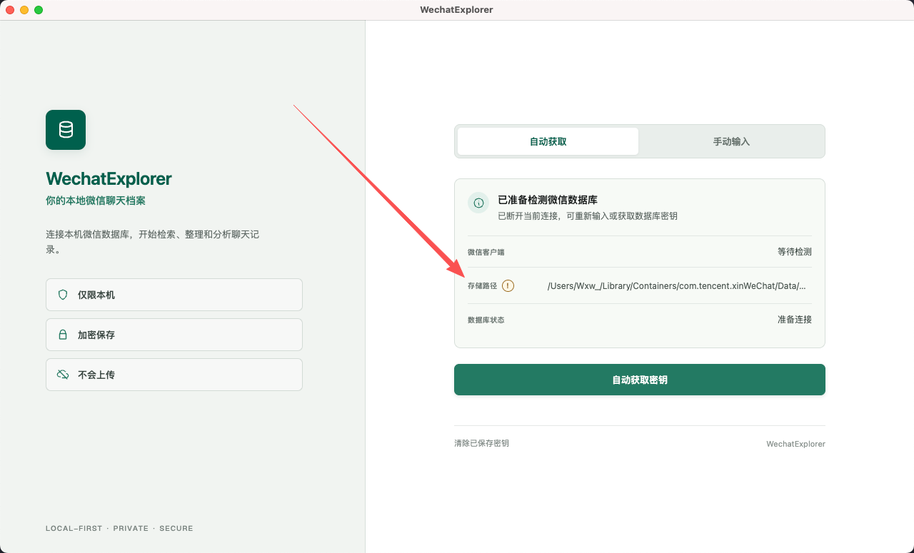
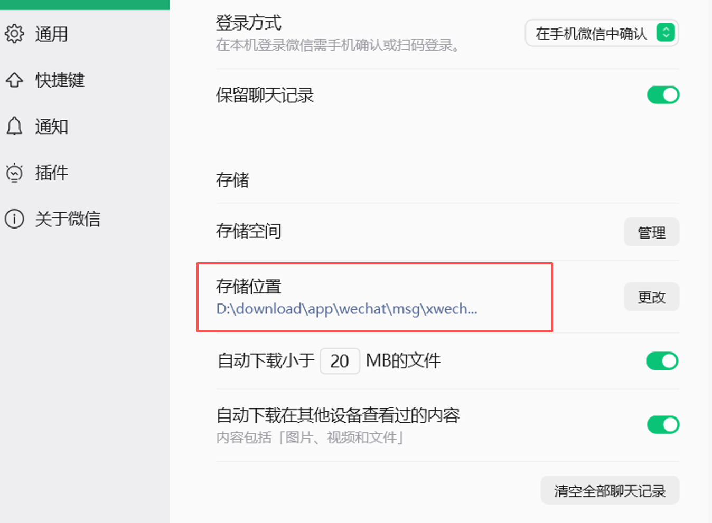
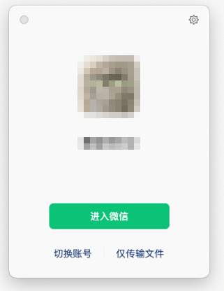
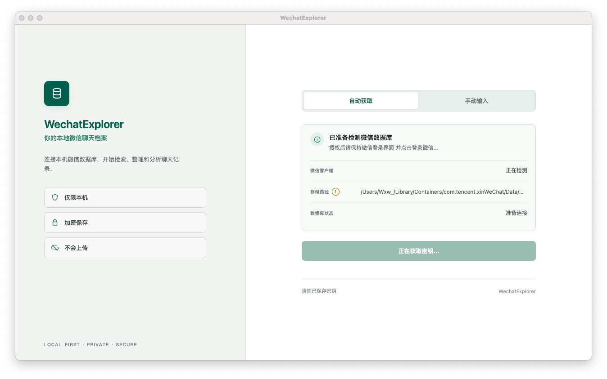
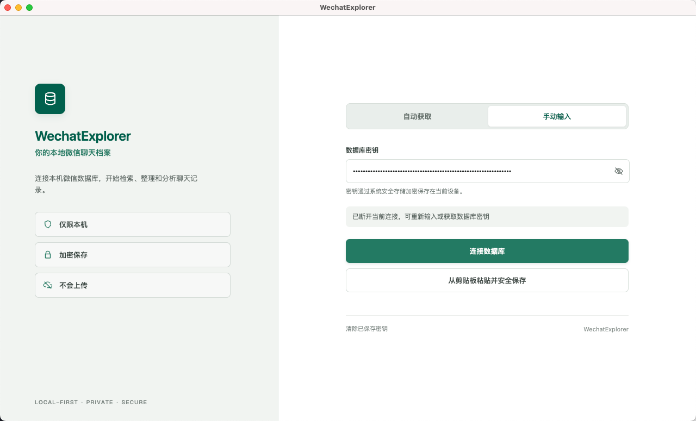

# WechatExplorer 使用教程

本文介绍如何安装 WechatExplorer、自动获取微信数据库密钥，并完成首次连接。

## 1. 使用前准备

### 支持的版本

| 系统 | 已测试的微信版本 | 说明 |
| --- | --- | --- |
| macOS | `4.1.8.100` | 支持相对稳定；自动获取密钥前需要关闭 SIP |
| Windows | `4.1.9.57` | 已初步支持；不同安装路径和数据目录可能仍需手动调整 |

- macOS 微信下载：[wechat-versions v4.1.8.100](https://github.com/zsbai/wechat-versions/releases/tag/4.1.8.100)
- Windows 微信下载：[wechat-win-archive v4.1.9.57](https://github.com/iibob/wechat-win-archive/releases#release-v4.1.9.57)
- WechatExplorer 下载：[GitHub Releases](https://github.com/Wxw-Gu/WechatExplorer/releases)

> [!IMPORTANT]
> WechatExplorer 必须取得本机微信数据库密钥才能读取聊天记录。请仅处理你有权访问的数据。

### macOS：关闭 SIP

macOS 自动获取密钥前需要关闭 SIP，具体操作见 [macOS 关闭 SIP 教程](../mac-disable-sip.md)。

关闭 SIP 会降低系统安全性。建议了解风险后再操作，并在不再需要自动获取密钥时重新开启。

## 2. 安装 WechatExplorer

### macOS

1. 从 Releases 下载 `.dmg` 文件。
2. 打开 DMG，将 WechatExplorer 拖入“应用程序”文件夹。
3. 如果系统提示“无法打开，因为开发者无法验证”，请前往“系统设置 → 隐私与安全性”，点击“仍要打开”。
4. 如果系统提示应用已损坏，在终端执行：

   ```bash
   xattr -cr "/Applications/WechatExplorer.app"
   ```

### Windows

1. 从 Releases 下载 `-setup.exe` 安装包。
2. 双击安装，并按安装向导完成操作。

## 3. 自动获取密钥

### 第一步：确认微信数据目录

启动 WechatExplorer 后，先检查页面中的“存储路径”是否正确。



Windows 当前不会扫描二级目录。如果没有正确识别微信数据，请进入“设置”，手动选择微信数据所在目录。



### 第二步：让微信停留在登录页面

如果微信已经登录，请先退出登录；然后重新打开微信，让它停留在未登录页面，暂时不要点击登录。



### 第三步：开始获取密钥

返回 WechatExplorer，点击“自动获取密钥”。

- **Windows**：看到“Hook 注入成功”后，返回微信完成登录。
- **macOS**：系统会弹出授权提示，请输入当前 macOS 用户密码并完成授权，然后返回微信完成登录。



> 点击“自动获取密钥”前，微信必须停留在登录页面。WechatExplorer 提示可以登录后，再回到微信完成登录。

### 第四步：完成连接

如果系统环境和微信版本符合要求，WechatExplorer 会自动填写数据库密钥并连接数据库。连接成功后即可查看、搜索和导出聊天记录，也可以配置 AI 服务生成群聊总结。



## 4. 图片解密密钥

微信 4.0 及以上版本的图片通常以 `.dat` 文件存储，显示图片还需要：

- **XOR Key**：单字节十六进制值，例如 `0x40`。
- **AES Key**：用于 AES-128-ECB 解密的 16 字符字符串。

可以通过以下方式配置：

1. 使用首次连接页面的“自动获取密钥”。
2. 在“设置 → 图片解密密钥”中自动获取或手动填写。
3. 从 WeFlow 或 Chatlog 的设置中导出后手动填写。

数据库连接成功但图片无法显示时，请优先检查这两项密钥。

## 5. 常见问题

### 自动获取密钥失败

请依次确认：

1. 微信版本是否与上方已测试版本一致。
2. 点击“自动获取密钥”时，微信是否停留在未登录页面。
3. 微信数据目录是否正确；Windows 用户尤其需要检查是否多选或少选了一层目录。
4. macOS 是否已按教程关闭 SIP，并完成系统授权。
5. 微信和 WechatExplorer 是否都保持运行。

仍然失败时，可以切换到“手动输入”，粘贴从其他兼容工具中取得的数据库密钥。

### Windows 使用时卡顿

Windows 支持仍处于初步阶段，不同微信版本、安装路径、数据目录和权限环境可能存在差异。建议优先使用上方已测试的微信版本。

### 数据会上传吗？

聊天数据库在本机读取和处理。只有使用 AI 总结功能时，相关聊天内容才会按你配置的模型服务发送；是否启用以及使用哪个服务由你决定。

## 6. 下一步

- 在应用“设置”中填写兼容 OpenAI API 的模型服务和 API Key，使用 AI 总结功能。
- 在应用的 **API** 页面安装 Reader Skill，让 Codex 或 Claude Code 读取和总结本地群聊。
- 本地 API 的端点和调试方法见项目 [README](../../README.md#ai-集成本地-http-api)。
