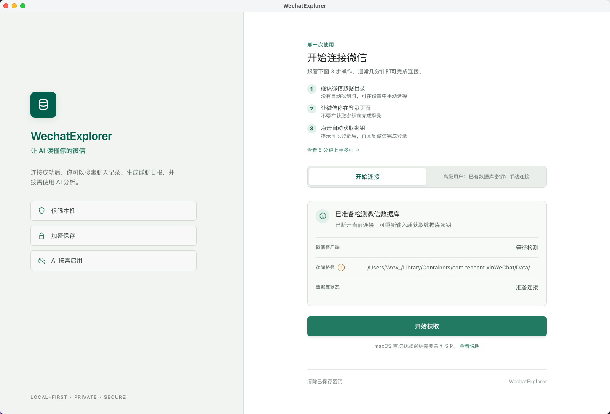
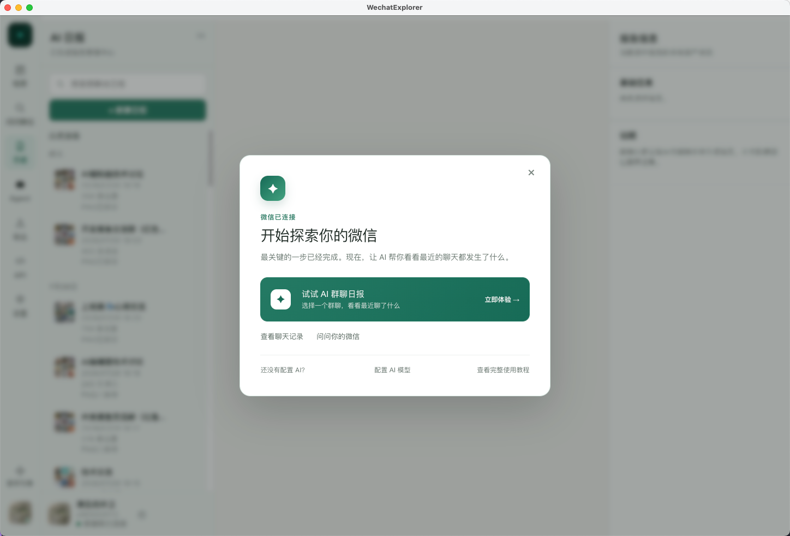

# WechatExplorer：第一次使用与问题排查

这份说明解决三件事：第一次连接微信、连接成功后如何开始使用，以及遇到问题时如何自助排查。

如果你已经进入软件，忘记了连接步骤，可以直接点击左下角「新手引导」，重新查看首次连接流程、AI 配置入口和群聊日报入口。

## 你现在要做什么

- [我第一次使用，想连接微信](#第一次连接微信)
- [我已经连接成功，下一步做什么](#连接成功后做什么)
- [我想重新查看引导](#重新查看新手引导)
- [我想配置 AI](#配置-ai)
- [我遇到问题](#遇到问题)
- [我想让 Agent 读取微信](#接入-api-reader-skill-或-agent)

> 正常覆盖安装只会替换应用程序文件，WechatExplorer / 迹忆不会主动删除或修改微信原始聊天记录。应用缓存和本地设置可能随版本升级发生变化。系统故障、磁盘异常、误操作和微信自身迁移不受本应用控制，因此升级前仍建议使用微信官方迁移或备份功能备份重要聊天记录，不要将唯一副本保存在单一设备。

## 开始前确认

| 系统    | 已测试的微信客户端                                                                                | 需要注意                                    |
| ------- | ------------------------------------------------------------------------------------------------- | ------------------------------------------- |
| macOS   | [微信 macOS `4.1.8.100`](https://github.com/zsbai/wechat-versions/releases/tag/4.1.8.100)         | 自动获取数据库密钥前需要关闭 SIP 并完成授权 |
| Windows | [微信 Windows `4.1.9.57`](https://github.com/iibob/wechat-win-archive/releases#release-v4.1.9.57) | 已完整支持；首次使用时请确认微信数据目录    |

- WechatExplorer 当前面向微信 4.0 数据结构。
- Windows 不需要关闭 SIP。
- macOS 首次自动获取数据库密钥需要按页面提示完成系统授权。
- WechatExplorer 必须取得当前微信账号对应的数据库密钥才能读取聊天记录。
- 请只处理你有权访问的微信数据。

WechatExplorer / 迹忆应用安装包：[GitHub Releases](https://github.com/Wxw-Gu/WechatExplorer/releases)。Windows 选择 `-setup.exe`，macOS 按处理器架构选择对应 `.dmg`。微信客户端请使用上方“已测试的微信客户端”链接。

## 第一次连接微信

### 1. 安装 WechatExplorer

#### Windows

1. 从 Releases 下载 Windows `-setup.exe` 安装包。
2. 双击安装包，按向导完成安装。
3. 启动 WechatExplorer。

#### macOS

1. 从 Releases 下载 `.dmg` 文件。
2. 打开 DMG，将 WechatExplorer 拖入“应用程序”文件夹。
3. 如果系统提示“无法打开，因为开发者无法验证”，前往“系统设置 → 隐私与安全性”，点击“仍要打开”。
4. 如果系统提示应用已损坏，可在终端执行：

   ```bash
   xattr -cr "/Applications/WechatExplorer.app"
   ```

5. 如果这是第一次在 macOS 上自动获取数据库密钥，先完成 [关闭 SIP 教程](../mac-disable-sip.md)。关闭 SIP 会降低系统安全性，完成密钥配置后建议重新开启。

### 2. 按软件内引导连接微信

首次启动会自动进入「第一次使用」页面。页面会根据当前系统显示连接方式和注意事项：

<p align="center">
  
</p>

通常按下面三步操作即可：

1. **确认微信数据目录**：自动识别不准确时，在页面中修改存储路径。
2. **让微信停在登录页面**：如果微信已经登录，先退出微信登录，不只是关闭窗口。
3. **点击开始获取**：软件会尝试获取数据库密钥。按提示可以登录后，再回到微信完成登录。

Windows 已完整支持，不需要关闭 SIP。macOS 首次获取密钥前，需要按页面提示完成授权并关闭 SIP。

### 3. 连接成功

连接成功后，软件会进入聊天档案，并显示「开始探索你的微信」引导：

<p align="center">
  
</p>

这里推荐先体验「AI 群聊日报」，也可以直接查看聊天、问问微信或配置 AI 模型。

## 连接成功后做什么

### AI 问问微信

打开「问问微信」，用自然语言向自己的微信提问，例如：

- “技术群这周讨论了哪些问题？”
- “帮我找到张三发过的项目地址。”
- “去年我和老板聊过哪些关于涨薪的事情？”

如果还没有配置 AI，点击「设置 → AI 模型」添加模型服务商并测试连接。

### AI 群聊日报

1. 打开「日报」。
2. 选择一个群聊和时间范围。
3. 按需要选择日报内容和模板。
4. 开始生成，完成后查看或导出 HTML 与 PNG。

日报会整理讨论摘要、关键主题、重要消息、资源、问题和待跟进事项，并保留证据来源。

### 查看聊天

1. 打开「档案」。
2. 选择好友或群聊。
3. 浏览历史消息，也可以按关键词定位会话。

### 导出聊天

打开「导出」，选择联系人或群聊、时间范围和格式。支持 HTML、CSV、JSON 和 Markdown。

## 重新查看新手引导

连接成功后，首次弹窗关闭不会影响功能使用。需要重新查看时，点击主界面左下角的「新手引导」：

<p align="center">
  
</p>

新手引导会再次展示：

- AI 群聊日报入口。
- 查看聊天记录入口。
- 问问微信入口。
- AI 模型配置入口。
- 完整使用教程入口。

## 配置 AI

WechatExplorer 支持 OpenAI 兼容接口，也提供 DeepSeek、OpenAI、Claude、Moonshot 等常用配置方式。

1. 进入「设置 → AI 模型」。
2. 添加模型服务商并填写 API Key。
3. 确认 Base URL 和模型名称正确。
4. 保存并测试连接。
5. 返回「问问微信」或「日报」重试。

AI 功能使用你配置的模型服务。相关聊天内容会按请求发送给该服务；是否启用以及使用哪一个服务由你决定。

## 遇到问题

先判断你遇到的现象，再按对应路径处理。

| 现象                              | 优先检查                                                 |
| --------------------------------- | -------------------------------------------------------- |
| 软件打不开                        | macOS 安全提示或应用损坏处理；Windows 重新运行安装包     |
| 找不到微信数据                    | 在首次连接页面或设置中确认数据目录，Windows 检查目录层级 |
| 获取不到数据库密钥                | 微信是否停留在登录页面、微信和应用是否同时运行           |
| 数据库连接失败                    | 当前账号是否匹配、微信版本是否兼容、数据库目录是否正确   |
| 已连接但图片不显示                | 配置图片 XOR Key 和 AES Key                              |
| AI 问问微信或日报不可用           | 在「设置 → AI 模型」配置并测试模型服务                   |
| API、Reader Skill 或 Agent 不可用 | 先连接数据库，再确认 API 服务状态和对应配置              |

### 软件打不开

#### macOS

- 出现“无法打开，因为开发者无法验证”：前往“系统设置 → 隐私与安全性”，点击“仍要打开”。
- 出现“应用已损坏”：确认应用位于“应用程序”目录，再执行：

  ```bash
  xattr -cr "/Applications/WechatExplorer.app"
  ```

#### Windows

确认下载的是 Releases 中的 `-setup.exe` 安装包，并按安装向导完成安装。Windows 不需要关闭 SIP。

### 找不到微信数据

在首次连接页面确认“存储路径”。如果没有自动识别：

1. 打开「设置」。
2. 手动选择微信数据所在目录。
3. 返回连接页面，重新测试连接。

Windows 当前不会扫描二级目录，请确认目录没有多选或少选一层目录。

### 获取不到数据库密钥

按顺序检查：

1. 微信版本是否与上方已测试版本一致。
2. 点击“开始获取”时，微信是否停留在未登录页面。
3. 微信和 WechatExplorer 是否都保持运行。
4. 微信数据目录是否准确。
5. macOS 是否已关闭 SIP 并完成系统授权。

仍然失败时，可以在连接页面切换为“高级用户：已有数据库密钥？手动连接”，粘贴从其他兼容工具中取得的数据库密钥。手动输入的密钥必须与当前微信账号匹配。

### 数据库连接失败或账号不匹配

数据库密钥与微信账号绑定。请确认：

- 当前微信登录的是获取密钥时对应的账号。
- WechatExplorer 选择的是该账号的数据目录。
- 没有把其他账号或旧数据目录的密钥粘贴进来。

### 已连接但图片无法显示

微信 4.0 的图片通常以 `.dat` 文件存储。显示图片还需要：

- **XOR Key**：单字节十六进制值，例如 `0x40`。
- **AES Key**：用于 AES-128-ECB 解密的 16 字符字符串。

进入「设置 → 图片解密密钥」，选择自动获取或手动填写。也可以从 WeFlow 或 Chatlog 的设置中导出后填写。文字聊天记录不受图片密钥影响。

### 我已经连接成功，怎么重新查看教程？

点击左下角「新手引导」。

首次连接流程、AI 配置入口、群聊日报、问问微信和完整教程都会再次展示。

## 接入 API、Reader Skill 或 Agent

这是高级使用路径，请先完成数据库连接并熟悉「问问微信、日报、档案、导出」的基础流程。

### Reader Skill

1. 打开应用的「API」页面。
2. 确认本地 API 已运行；如果已停止，点击“启动服务”。
3. 在“快速接入”中选择 Codex 或 Claude Code。
4. 复制安装指令，粘贴给对应 Agent 执行。
5. 安装完成后，让 Agent 读取和总结本地聊天。

本地 API 默认地址为 `http://127.0.0.1:6131`，默认仅监听本机且无鉴权。详细端点和参数见 [Reader Skill 文档](../skill/wechatexplorer-reader/SKILL.md)。

### Agent Hub

应用内的「Agent」页面用于管理 WechatExplorer 的 Agent 连接与运行状态，属于高级功能。

## 数据与隐私

- WechatExplorer 只读取你有权访问的本机微信数据。
- 不使用 AI 时，应用不会因为读取聊天记录而自动上传聊天内容。
- 使用 AI 问问微信、日报或图片理解时，相关内容会发送到你配置的模型服务。
- 本地 API 默认监听 `127.0.0.1`，且无鉴权。不要将它暴露在不可信的局域网环境中。

## 仍然无法解决？

请先完成上面的自助排查，再进入交流/售后群。提问时一次性提供：

1. 操作系统和版本。
2. 微信版本。
3. WechatExplorer 版本。
4. 当前处于哪一步，以及完整错误信息。
5. 必要截图；请遮挡账号、数据库密钥、API Key 和其他敏感信息。

交流二维码位于项目 [README](../../README.md) 文末。
